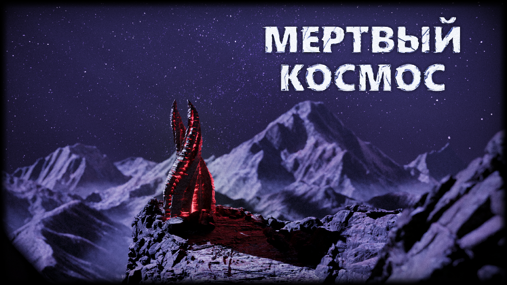

 

# Мёртвый Космос

**Мёртвый Космос Goob** / **Dead Space Goob** — русскоязычный форк Space Station 14 на сборке GoobStation.

Этот репозиторий содержит исходный код сборки Goob проекта Мёртвый Космос. Форк основан на цепочке upstream-проектов Space Station 14, Goob Station и CorvaxGoob;

## Ссылки

[Discord](https://discord.gg/ds14) | [Wiki](https://wiki.deadspace14.net/) | [Сайт](https://deadspace14.net/) | [Steam](https://store.steampowered.com/app/1255460/Space_Station_14/) | [Клиент без Steam](https://spacestation14.io/about/nightlies/) | [Основной репозиторий Space Station 14](https://github.com/space-wizards/space-station-14)

## Документация

На официальном сайте с [документацией](https://docs.spacestation14.io/) есть информация о контенте SS14, движке, дизайне игры и разработке. Учитывайте, что у Мёртвого Космоса есть собственные изменения и правила проекта.

## Контрибьют

Если вы хотите помочь с исправлениями, переводом или новым контентом, обсудите изменение в нашем [Discord](https://discord.gg/ds14) или отправьте pull request. Перед отправкой PR рекомендуется ознакомиться с официальным [руководством по pull requests](https://docs.spacestation14.com/en/general-development/codebase-info/pull-request-guidelines.html).

## Сборка

1. Склонируйте этот репозиторий локально.
2. Запустите `RUN_THIS.py` для инициализации подмодулей и скачивания движка.
3. Установите .NET 9 SDK.
4. Откройте консоль в директории проекта.
5. Соберите проект с помощью `dotnet build`.

[Более подробная инструкция по запуску проекта.](https://docs.spacestation14.com/en/general-development/setup.html)

## Лицензия

Код в этой кодовой базе распространяется под лицензией AGPL-3.0-or-later, если в конкретных файлах или `.license` файлах не указано иное. Заголовки REUSE, copyright notices, сведения об авторах и лицензиях upstream-проектов сохраняются и не являются пользовательским брендингом.

Большинство медиа-активов лицензированы по [CC-BY-SA 3.0](https://creativecommons.org/licenses/by-sa/3.0/), если не указано иное. Информация о лицензии и авторских правах для активов находится в файлах метаданных.

Некоторые активы могут быть лицензированы по некоммерческим лицензиям, например [CC-BY-NC-SA 3.0](https://creativecommons.org/licenses/by-nc-sa/3.0/) или аналогичным. Их необходимо проверить отдельно, если вы планируете коммерческое использование.
